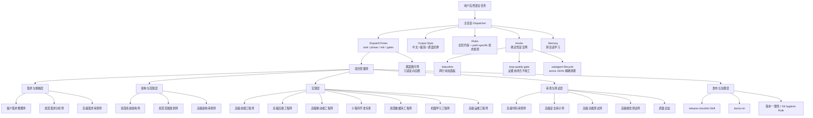
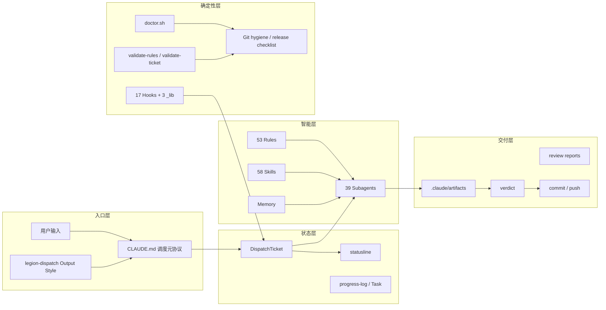
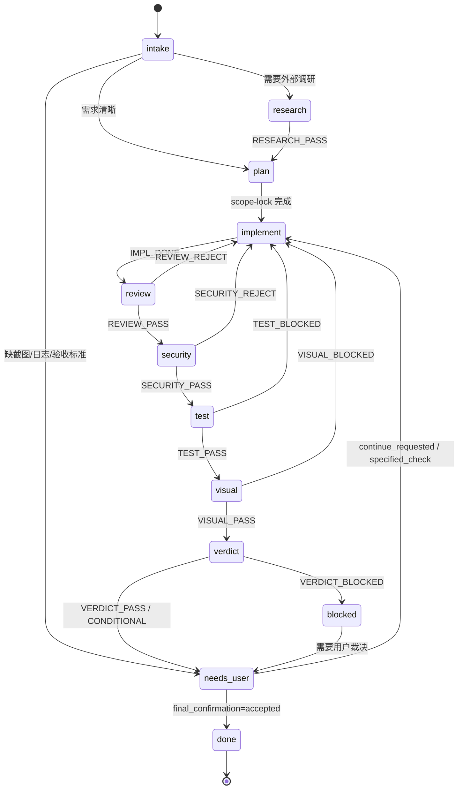
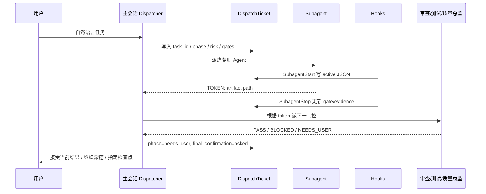
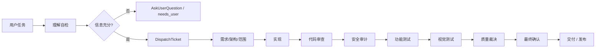
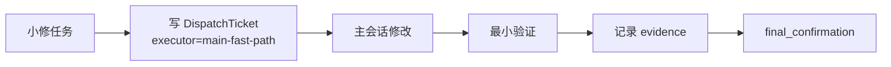
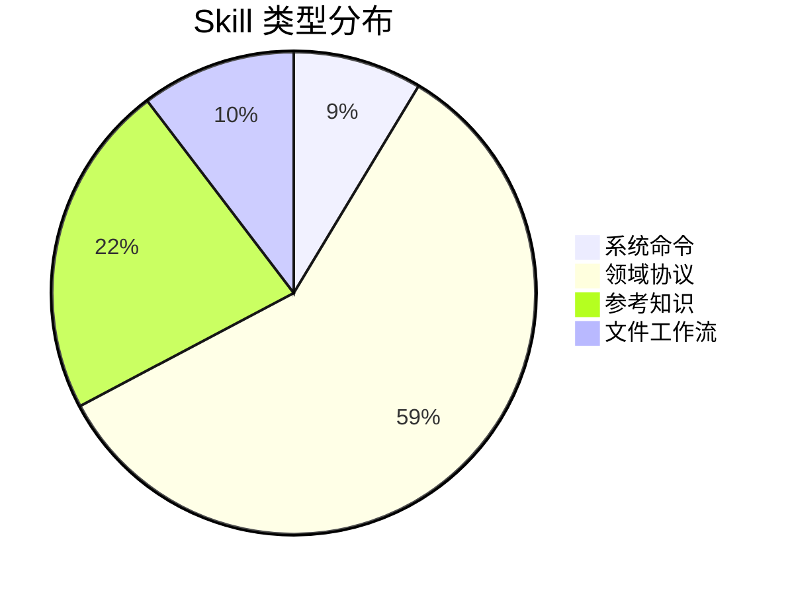

<div align="center">

# best-claude-code

### 一个把 Claude Code 变成工程团队的多 Agent 开发系统

**中文优先 · 多语言支持 · 结构化调度 · 对抗审查 · 可进化记忆 · 发布治理**

<br>

[](https://claude.com/claude-code)
[](./LICENSE)
[](#版本状态)
[](#多语言与技术栈)
[](#agent-矩阵)
[](#skill-体系)
[](#rule-体系)
[](#hook-安全网)

<br>

**[快速开始](#快速开始)** · **[系统架构](#系统架构)** · **[工作流](#端到端工作流)** · **[技术栈](#多语言与技术栈)** · **[治理闭环](#治理闭环)** · **[维护指南](./LEGION.md)**

<br>

> best-claude-code 不是一份普通 `CLAUDE.md` 模板，而是一套基于 Claude Code 全扩展机制构建的工程执行系统。
>
> 它把主会话变成调度器，把复杂任务拆给专职 Subagent，并用 Rules、Hooks、Skills、Memory、Output Style 和 DispatchTicket 形成可验证的交付闭环。

</div>

---

## 为什么需要 best-claude-code

单个强模型在大项目里最常见的问题不是“不会写代码”，而是：

- 上下文越来越脏，越做越不知道当前状态。
- 实现者自证正确，审查、测试、安全被口头带过。
- 改一个需求牵动多个模块，但缺少范围锁定和交接协议。
- 多轮返工没有沉淀，下次继续踩同一个坑。
- prompt、rule、hook、skill 各自漂移，版本文档和真实系统不一致。

best-claude-code 的核心判断是：

**干净上下文 + 明确职责 + 结构化证据 > 混乱上下文 + 最强模型硬抗。**

系统通过 39 个 Subagent、58 个 Skill、53 条 Rule、17 个主 Hook 和 3 个 hook 辅助库，把 Claude Code 组织成一个可调度、可审查、可进化的工程团队。

---

## 快速开始

### 1. 安装

```bash
git clone https://github.com/Xuuuuu04/best-claude-code.git ~/.claude
cd ~/.claude
cp settings.example.json settings.json
chmod +x hooks/*.sh hooks/_lib/*.sh bin/*.sh
```

### 2. 配置

编辑 `~/.claude/settings.json`，填入你的模型 Provider、API Key 和 hook 配置。

> 仓库不会包含真实密钥。`settings.json`、本地备份、日志、session 和 pending state 已被 `.gitignore` 排除。

### 3. 体检

```bash
bash ~/.claude/bin/doctor.sh
```

健康输出应至少满足：

- `0 failures`
- README 数字徽章与真实文件数量一致
- Release Readiness 版本一致
- Git hygiene 无运行态文件待提交

### 4. 使用

进入任意项目目录：

```bash
claude
```

首次进入项目建议：

```text
/bcc-init-project 这个项目是一个 SaaS 后台，包含前端、后端和数据库迁移
```

之后直接用自然语言描述任务：

```text
实现用户登录功能，支持邮箱密码和 Google OAuth
刷新 token 在并发请求下偶现失败，帮我定位并修复
给这个小程序班级管理页加搜索、分页和导出
写一篇 CVPR 风格论文初稿，主题是多模态医学图像配准
部署到生产前做一次安全审计和回滚方案
```

---

## 系统架构

### 总览



### 分层架构



### DispatchTicket 状态机



### Agent 调度序列



### 质量门控矩阵

| 阶段 | 产出 | 审查者 | 通过标准 | 打回路径 |
|:--|:--|:--|:--|:--|
| 需求 | requirements / scope intent | 高级需求审查师 | 目标、边界、验收标准清晰 | 回需求分析 |
| 架构 | ADR / architecture artifact | 高级架构审查师 | 模块边界、依赖、数据流自洽 | 回架构师 |
| 范围 | scope-lock | 高级架构审查师 / 项目管理师 | 文件级白名单、禁止事项明确 | 回范围规划 |
| 实现 | impl-report | 高级代码审查师 | diff 正确、契约一致、异常可读 | 回实现工程师 |
| 安全 | security-review | 高级安全审计师 | 无高危漏洞、权限边界清晰 | 回实现或架构 |
| 功能 | functional-review | 高级功能测试师 | 主路径和边界测试通过 | 回实现工程师 |
| 视觉 | visual-review | 高级视觉测试师 | 截图证据、交互可用 | 回前端/设计 |
| 裁决 | verdict | 质量总监 | 证据闭合，可交付 | blocked / needs_user |

---

## 端到端工作流

### 标准开发流水线



### 快路径

单文件、低风险、无 schema/依赖/API 变更的小修，可由主会话直接处理：



快路径仍然必须：

- 写 `state/legion-session.json`
- 记录 `fast_path_reason`
- 运行最小验证
- 在收尾前确认 `final_confirmation`

---

## Agent 矩阵

| 认知层 | Agent | 典型任务 |
|:--|:--|:--|
| 需求 | 客户需求整理师 / 资深需求分析师 / 高级需求审查师 | 客户原话整理、需求拆分、验收标准 |
| 调度 | 调度顾问师 / 项目管理师 | 只读调度自检、单跳调度、状态机、返工升级 |
| 架构 | 资深系统架构师 / 资深范围规划师 / 高级架构审查师 | ADR、scope-lock、依赖图 |
| 研究 | 代码库研究员 / 技术调研专家 / 高级调研审查师 | 仓库定位、外部文档、选型审查 |
| 实现 | 高级前端/后端/移动端/桌面工程师 | 业务功能、组件、API、客户端 |
| 专项 | 小程序开发专家 / 资深数据库工程师 / 机器学习工程师 / 高级运维工程师 | 小程序、schema、ML、部署 |
| 审查 | 高级代码审查师 / 高级安全审计师 | 代码质量、安全风险、契约一致性 |
| 测试 | 高级功能测试师 / 高级视觉测试师 | E2E、边界、截图证据 |
| 裁决 | 质量总监 | 汇总证据、通过/有条件通过/打回 |
| 内容 | 文档工程师 / 创意策划师 / 视觉设计专家 / 多媒体内容生成师 | 文档、品牌、设计、视频 |
| 学术 | 学术论文写作专家 / 顶会顶刊审稿专家 / 引用审计员 / 论文数字审计员 / 定理证明审计员 | 论文写作、审稿、引用、数字和证明审计 |
| 元治理 | Claude Code 工作流与提示词设计大师 | Agent/Skill/Rule/Output Style 进化 |

### 调度顾问师：反向 Advisor

`调度顾问师` 不是第二个 PM，也不是质量总监。它是主会话的只读反向自检节点，用来切断“一个模型自己理解、自己实现、自己审查、自己宣布完成”的交付风险。

触发它的典型信号：

- 主会话不知道下一步该派谁，或怀疑当前任务理解已经漂移。
- 准备压缩/跳过质量门控，但用户没有显式要求降级。
- 新增 Agent 前，需要判断现有 Agent 是否已经覆盖，避免职责膨胀。
- 用户要求“全面、对抗、质量提高、反复检查、不要单模型自证”。
- 任务跨多轮后，证据、scope、assumptions 与最新用户输入可能不一致。

它只输出 `DISPATCH_ADVICE`，不得写文件、不得派下游、不得替代 `项目管理师` 推进状态，也不得替代 `质量总监` 做最终裁决。主会话采纳或拒绝建议时，都要把理由写进 `decision_summary`。

它不维护静态 Agent 名单。每次判断前都应读取 `rules/_global/dispatch-table.md` 和 `agents/*.md` 的 frontmatter，因此未来新增普通 Agent 时，只要 description 写清楚，调度顾问师不需要额外补名单。

---

## Skill 体系

58 个 Skill 分为四类：



| 类型 | 用途 | 示例 |
|:--|:--|:--|
| 系统命令 | 确定性运维入口 | `bcc-init-project`、`bcc-doctor`、`release-checklist` |
| 领域协议 | Agent 预加载工作流 | `implementation-protocol`、`code-review-protocol`、`quality-verdict` |
| 参考知识 | 技术深水区资料 | `cangjie-language`、`huawei-ascend`、`architecture-patterns` |
| 文件工作流 | 文档/表格/演示处理 | `docx-workflow`、`xlsx-workflow`、`pptx-workflow`、`pdf-workflow` |

---

## Rule 体系

53 条 Rule 覆盖：

- 调度真源：`dispatch-table`
- Artifact 协议：`artifact-protocol`
- 审查独立性：`reviewer-independence`
- 发布治理：`release-version-consistency`
- Git hygiene：`runtime-state-git-hygiene`
- Statusline 合约：`statusline-contract`
- 语言规范：TypeScript、Python、Java、Go、Rust、Swift、Kotlin、Dart、SQL、LaTeX 等
- 框架规范：React、Vue、Svelte、Angular、Next、Nuxt、Spring、Django、FastAPI、Flask、Rails、Laravel、Tailwind、Prisma、微信小程序等
- 基础设施：Docker、CI/CD、环境配置

Rule 是 path-specific 的，读取或编辑匹配文件时才激活，避免无关上下文污染。

---

## Hook 安全网

17 个主 hook + 3 个 `_lib` 脚本提供确定性保障：

| Hook | 作用 |
|:--|:--|
| `session-start` | 注入项目状态、git 摘要、DispatchTicket 摘要 |
| `pre-compact` / `post-compact` | 压缩前后状态恢复 |
| `clarification-gate` | 缺资产/需求模糊时注入理解检查或拦截 |
| `review-gate` | 提醒未 review 改动 |
| `scope-lock-guard` | 阻止越过 scope-lock |
| `orchestrator-edit-guard` | 防止主会话越权改业务文件 |
| `subagent-start-mark` | 写 active JSON 状态 |
| `subagent-stop-log` | 清理 active 状态并写 evidence/gate |
| `stop-quality-gate` | 证据未闭合时阻止收工；`done + asked/required` 会自动回退到 `needs_user`，避免确认问题发出前被错误打断 |
| `post-edit-lint` | 编辑后轻量 lint |
| `instructions-audit` | 指令加载审计 |
| `tool-failure-audit` | 工具失败记录 |
| `artifact-*` | artifact 写入和索引提示 |

---

## Statusline

v4.7 起 statusline 是两行协议：

```text
⚡ LEGION  ▶ 代理 2x Explore · max 1m24s · 模型 ◆ Claude · 权限 default
任务 chore…dispatch-loop · 阶段 needs_user · 风险 medium fast · 门控 c:✓ f:✓ vd:✓ · 理解 clear:.92 · 迭代 pass#0 · 确认 ask · CTX 64% · ◷ 14:35
```

设计约束：

- 第 1 行只放运行态：品牌、活跃代理、模型、权限。
- 第 2 行只放任务闭环：任务、阶段、风险、门控、理解、迭代、确认、上下文、时间。
- 窄屏自动压缩：`理解 clear:0.86` → `U clear:.86`，`final_confirmation required` → `C req`。
- active subagent 文件超时会被忽略并清理，避免展示假的活跃代理。

---

## 治理闭环

### DispatchTicket

所有业务实现、业务文件修改或 Agent 团队调度前，写入：

```text
.claude/state/legion-session.json
```

关键字段：

```json
{
  "task_id": "feat-20260504-login",
  "phase": "implement",
  "risk": "medium",
  "executor": "agent-team",
  "required_gates": ["code", "security", "functional", "visual", "verdict"],
  "understanding": {
    "status": "clear",
    "confidence": 0.9
  },
  "iteration": {
    "mode": "until_pass",
    "round": 0
  },
  "final_confirmation": "required"
}
```

校验：

```bash
bash ~/.claude/bin/validate-dispatch-ticket.sh
```

### Release checklist

发布前运行：

```bash
bash -n statusline.sh hooks/*.sh hooks/_lib/*.sh bin/*.sh
bash bin/validate-dispatch-ticket.sh state/legion-session.json
bash bin/test-hook-flags.sh
bash bin/validate-rules.sh
bash bin/doctor.sh
git diff --check
git status --short
```

发布后确认：

```bash
git rev-parse HEAD
git rev-parse origin/main
```

两者必须一致。

---

## 多语言与技术栈

### 支持语言

| 类型 | 语言 |
|:--|:--|
| Web / App | TypeScript、JavaScript、Dart、Swift、Kotlin |
| 后端 | Python、Java、Go、Rust、C#、PHP、Ruby、Scala |
| 系统 / 性能 | C、C++、Rust、Go |
| 数据 / 文档 | SQL、LaTeX、Shell |
| 专项 | 仓颉语言、Ascend C / CANN 生态 |

### 支持框架

| 方向 | 框架 |
|:--|:--|
| 前端 | React、Vue、Svelte、Angular、Next.js、Nuxt、Tailwind |
| 后端 | Express、NestJS、Spring、Django、FastAPI、Flask、Rails、Laravel、ASP.NET Core |
| 数据 | Prisma、SQL、迁移脚本、索引策略 |
| 移动端 | iOS、Android、Flutter、React Native |
| 小程序 | 微信小程序、uni-app |
| DevOps | Docker、GitHub Actions、GitLab CI、环境配置 |
| 多媒体 | Remotion、React 动画、视频/幻灯片代码生成 |

---

## 典型场景

| 场景 | 推荐路径 | 质量门控 |
|:--|:--|:--|
| 新功能 | 需求 → 架构 → scope → 实现 → 审查 → 测试 → 裁决 | full / adversarial-default |
| Bug 修复 | 代码库研究 → 实现 → 回归 → 审查 | code + functional |
| UI 改版 | 视觉设计 → 前端实现 → 视觉测试 | visual 不可跳 |
| API 分页 | 架构/接口契约 → 后端实现 → 测试 | code + functional + security |
| DB schema | 数据库工程师 → 迁移 → 回滚方案 | full |
| 部署上线 | 运维工程师 → release checklist → doctor | security + verdict |
| 论文写作 | 学术写作 → 顶会审稿 → 引用/数字/证明审计 | academic review |
| 调度不确定 / 职责混同 | 调度顾问师 → 项目管理师或用户确认 | dispatch-advice |
| Agent/Rule/Skill 改造 | 提示词设计大师 → doctor → release checklist | meta-governance |

---

## 目录结构

```text
.claude/
├── CLAUDE.md                  # 调度元协议
├── README.md                  # 项目说明
├── LEGION.md                  # 深度维护指南
├── EVOLVE-LOG.md              # 进化历史
├── agents/                    # 39 个 Subagent
├── skills/                    # 58 个 Skill
├── rules/                     # 53 条 Rule
│   ├── _global/
│   ├── _lang/
│   ├── _framework/
│   └── _infra/
├── hooks/                     # 17 个主 hook + 3 个 _lib
├── bin/                       # doctor / validator / release 工具
├── output-styles/             # legion-dispatch
├── state/                     # 发布态 DispatchTicket
└── settings.example.json      # 配置模板
```

---

## 与普通模板的区别

| 维度 | best-claude-code | 普通 CLAUDE.md 模板 | 静态 Agent 集合 |
|:--|:--|:--|:--|
| 主会话定位 | 调度器 | 自由发挥 | 不确定 |
| Agent 拓扑 | 39 个按认知模式分层 | 无 | 多按技术栈堆叠 |
| 质量门控 | 需求/架构/代码/安全/功能/视觉/裁决 | 通常无 | 不稳定 |
| 状态可见性 | DispatchTicket + statusline | 无 | 少量 |
| 规则激活 | path-specific Rules | 全局文本 | 不稳定 |
| 发布治理 | doctor + release checklist + Git hygiene | 手动 | 手动 |
| 自我进化 | Memory → Rule/Skill 固化 | 无 | 无 |
| 中文体验 | 原生中文优先 | 取决于模板 | 取决于 Agent |

---

## 版本状态

当前版本：**v4.7**

规模：

- 39 Agents
- 58 Skills
- 53 Rules
- 17 main Hooks + 3 `_lib`

最近关键升级：

- statusline 两行协议
- DispatchTicket validator
- final confirmation 入口分类
- release checklist
- 版本一致性 Rule
- runtime state Git hygiene Rule
- statusline contract Rule
- doctor Release Readiness 检查
- 调度顾问师：只读反向自检动态理解、职责边界、质量门控和单模型交付风险

---

## 贡献

欢迎提交 PR：

- 新语言 / 新框架 Rule
- Hook 可靠性改进
- Skill examples / references 补充
- Agent 职责边界收敛
- doctor 检查项增强

PR 请说明：

- 解决什么问题
- 影响哪些 Agent / Skill / Rule / Hook
- 是否改变调度表
- 是否需要更新 `README.md`、`LEGION.md`、`EVOLVE-LOG.md`
- 已运行哪些验证命令

---

## 致谢

本项目建立在 Claude Code 的扩展机制之上，特别感谢 Anthropic 提供的 CLAUDE.md、Subagents、Skills、Hooks、Memory、Rules 和 Output Styles 生态。

初版设计由项目维护者与 Claude Opus 4.7 合作完成，后续通过 Agent Legion 的进化协议持续迭代。

---

## License

MIT
